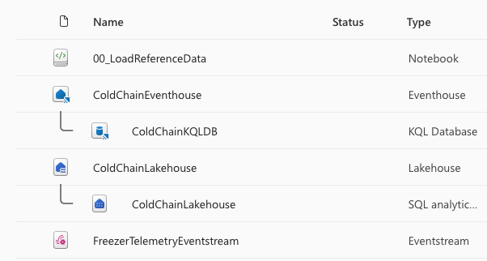
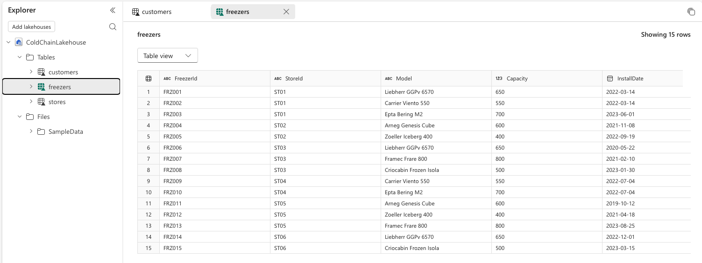
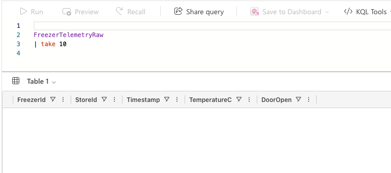

# Lab 00: Environment Setup and Verify

**Duration:** 15 minutes
**Prerequisites:** You (or your organization's Fabric admin) completed
[`prerequisites/PREREQUISITES.md`](../../prerequisites/PREREQUISITES.md) and ran
`setup/provision_fabric_iq.py` **before arriving today**. This lab does not provision anything new — it
verifies that provisioning succeeded and helps you recover if it didn't.

**Learning objectives**
- Confirm the "Fabric IQ" workspace and its four provisioned items exist and are healthy.
- Confirm the Lakehouse's reference tables contain data.
- Confirm the Eventhouse's raw telemetry table exists (even though it's expected to be empty right now).
- Know where to go for help if your own environment isn't in the expected state.

## Before you begin

Confirm your environment matches this state before starting:
- [ ] You have a browser signed in to the Fabric account you used with `provision_fabric_iq.py`, or the
      account your org's admin provisioned for you.
- [ ] You ran the setup script (directly, or via `setup/run-setup.sh` / `setup/run-setup.ps1`) and it
      reported success, per [`setup/README.md`](../../setup/README.md).
- [ ] If you never ran the script, or it errored out, don't worry — Steps 1–2 below will make that
      obvious, and the Troubleshooting block tells you what to do about it.

## Steps

1. **Open** [app.fabric.microsoft.com](https://app.fabric.microsoft.com) in your browser and sign in if
   prompted.

   

   > ✅ Expected result: the Fabric portal home page loads, showing your recent items and a workspace list
   > in the left navigation.

2. **Click** **Workspaces** in the left navigation, then **click** the **Fabric IQ** workspace.

   

   <details>
   <summary>Troubleshooting</summary>

   If you don't see a workspace named exactly **Fabric IQ** in the list, the provisioning script either
   wasn't run, didn't finish, or created the workspace under a different account than the one you're
   signed in with now. Do not try to re-run the script live unless you have a laptop and 5–10 minutes
   free — see the "If your environment isn't ready" section below instead.
   </details>

   > ✅ Expected result: the workspace opens and shows a list of items.

   *Adapted from: [Get started with Fabric IQ](https://learn.microsoft.com/fabric/iq/get-started-with-fabric-iq)*

3. **Confirm** the item list shows exactly these four items (names are case-sensitive and exact):
   - `ColdChainLakehouse` (Lakehouse)
   - `ColdChainEventhouse` (Eventhouse)
   - `FreezerTelemetryEventstream` (Eventstream)
   - `00_LoadReferenceData` (Notebook)

   

   <details>
   <summary>Troubleshooting</summary>

   Missing one or more items? Re-run `provision_fabric_iq.py` — it's safe to re-run and will only create
   what's missing, not duplicate what already exists. If it still fails, see
   [`setup/README.md`](../../setup/README.md) for mapped error messages, or flag a facilitator.
   </details>

   > ✅ Expected result: all four items are present. You do **not** see an Ontology, Graph, or Data Agent
   > item yet — those don't exist yet on purpose. We build them live starting in Module 03.

4. **Click** **ColdChainLakehouse** to open it, then **expand** the **Tables** node in the left Explorer
   pane if it isn't already expanded.

   

   > ✅ Expected result: three Delta tables are listed — `Customers`, `Stores`, `Freezers`.

5. **Click** each of the three tables in turn and **confirm** each one shows rows of data in the preview
   pane, not an empty table.

   

   <details>
   <summary>Troubleshooting</summary>

   Tables exist but are empty? The `00_LoadReferenceData` notebook may not have run to completion.
   **Open** the `00_LoadReferenceData` notebook from the workspace item list and **click** **Run all** to
   re-seed the reference data, then come back and re-check the tables. If it still fails, see
   [`setup/README.md`](../../setup/README.md).
   </details>

   > ✅ Expected result: `Customers`, `Stores`, and `Freezers` each contain multiple rows of reference
   > data — this is the static business context Module 02 grounds live telemetry against.

   *Adapted from: [Get started with Fabric IQ](https://learn.microsoft.com/fabric/iq/get-started-with-fabric-iq)*

6. **Go back** to the workspace item list and **click** **ColdChainEventhouse** to open it, then **click**
   the **ColdChainKQLDB** database in the left Explorer pane.

   

   > ✅ Expected result: the KQL database opens with a query editor pane and `FreezerTelemetryRaw` listed
   > as a table under the database.

7. **Type** the following query into the query editor and **click** **Run**:

   ```kql
   FreezerTelemetryRaw
   | take 10
   ```

   

   > ✅ Expected result: the query runs successfully and returns **zero rows**. This is expected, not a
   > bug — the `FreezerTelemetryRaw` table exists and is ready to receive data, but the synthetic freezer
   > telemetry generator hasn't been started yet. That happens in Module 02. If the query errors instead
   > of returning zero rows (for example, "table not found"), that's the actual problem to flag — see
   > Troubleshooting below.

   <details>
   <summary>Troubleshooting</summary>

   - **Query returns 0 rows:** expected — no action needed, continue to the checkpoint below.
   - **"Table 'FreezerTelemetryRaw' could not be resolved":** the Eventhouse/KQL database import may not
     have completed. Re-run `provision_fabric_iq.py`; if the table still doesn't appear, see
     [`setup/README.md`](../../setup/README.md).
   - **Query editor won't open / permissions error:** confirm you're signed in with the same account the
     script used, and that you have at least Contributor rights on the workspace — see
     [`prerequisites/PREREQUISITES.md`](../../prerequisites/PREREQUISITES.md).
   </details>

   *Adapted from: [Get started with Fabric IQ](https://learn.microsoft.com/fabric/iq/get-started-with-fabric-iq)*

## If your environment isn't ready

If any of the checks above failed and re-running `provision_fabric_iq.py` doesn't fix it within a couple
of minutes, don't burn your whole Module 00 slot troubleshooting solo:

- **Pair with a neighbor** whose environment verified successfully — this is the designated fallback per
  [`docs/risk-fallback-plan.md`](../../docs/risk-fallback-plan.md), and it's completely fine to follow
  along on someone else's screen for the rest of this section while your own gets sorted out at a break.
- Flag a facilitator — an already-provisioned "instructor" workspace is available to screen-share as a
  last resort.
- Full error-message-to-fix mappings live in [`setup/README.md`](../../setup/README.md) and
  [`prerequisites/PREREQUISITES.md`](../../prerequisites/PREREQUISITES.md) if you want to fix it properly
  at the next break instead of pairing up.

> 🎤 Facilitator note: pause here and ask who's seeing something different before moving on — this is a
> 20-minute agenda slot precisely because a few stragglers are expected; don't let it silently eat into
> Module 01's time.

<!-- facilitator: the most common failure here is signing in with a different account than the one the script authenticated with — check that first before assuming the script itself failed. -->

## Checkpoint

At the end of this lab, your "Fabric IQ" workspace should contain:
- `ColdChainLakehouse` with three populated tables: `Customers`, `Stores`, `Freezers`
- `ColdChainEventhouse` with a `ColdChainKQLDB` database containing an empty (but queryable)
  `FreezerTelemetryRaw` table
- `FreezerTelemetryEventstream`
- `00_LoadReferenceData` notebook

No Ontology, Graph, Data Agent, or Operations Agent items exist yet — that's expected. Continue to
[Module 01: Architecture & Context](../module-01-architecture-and-context/theory-01-fabric-iq-architecture-and-context.md).
